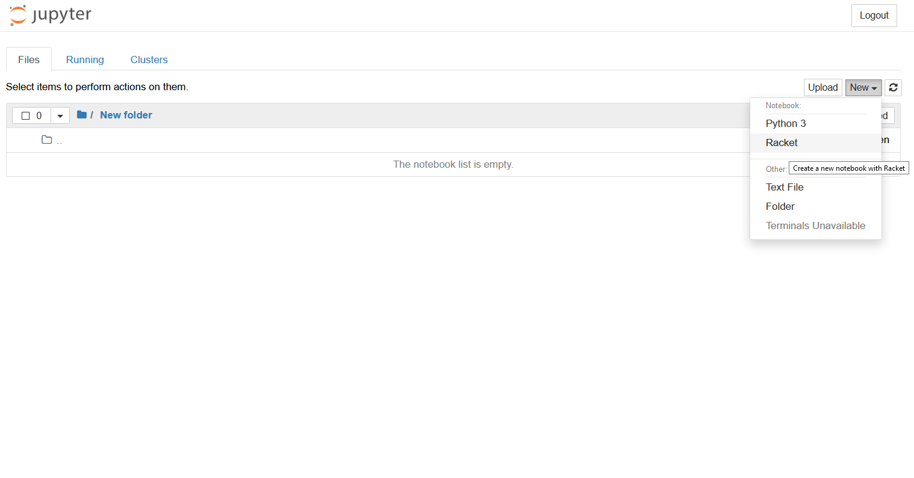

 
# Installation von Racket 

In diesem Seminar verwenden wir die Programmierumgebung [Racket](https://racket-lang.org/). Die Racket Umgebung 
beinhaltet die Programmiersprache Racket (ein Scheme dialekt), die Integrierte Entwicklungsumgebung DrRacket sowie Zahlreiche weitere Werkzeuge und Bibliotheken. 
Ausserdem benötigen wir eine Jupyter-Notebook Umgebung sowie den iRacket kern.

### Installation von Racket
Um Racket zu installieren, laden 
Sie den [Installer](https://download.racket-lang.org/) für Ihr Betriebssystem herunter und führen Sie diesen aus. Folgen Sie den Anweisungen des
Installationsprogramms. 


### Installation von Jupyter-Notebooks

Am einfachsten geht die Installation mit der Anaconda Distribution. Diese stellt eine komfortable Installationsumgebung zur Verfügung, mit der wir alle benötigten Komponenten mit wenigen Befehlen installieren können. Die Anaconda Distribution gibt es für die Betriebssysteme Windows, Linux und MacOS.

Laden Sie das graphische Installationsprogramm von [dieser Seite](https://www.anaconda.com/products/individual) herunter. Der Download Link befindet sich fast am Ende der Seite.
Führen Sie das Installationsprogramm aus und folgen Sie den Anweisungen. 

Die Detaillierte Installationsanleitung finden Sie [hier](https://docs.anaconda.com/anaconda/install/).


### Installation des iRacket Kernels

Damit Sie die Racket Umgebung aus Jupyter-Notebooks nutzen können, müssen Sie den [iRacket kern](https://github.com/rmculpepper/iracket) wie ```raco```, den Racket package manager , installieren. Dazu öffnen Sie ein Terminal 
und geben folgenden Befehl ein:
```
raco pkg install iracket
```
Nun müssen Sie den kern noch in Jupyter registrieren 
```
raco iracket install
```

Wenn Sie nun jupyter-notebooks starten, sollten Sie den iRacket Kern wie auf dem Bild unten auswählen können:

